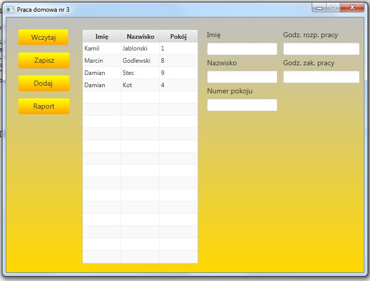

## Table of contents
* [General info](#general-info)
* [Additional info](#additional-info)
* [Screenshot](#screenshot)
* [Technologies](#technologies)
* [Author](#author)

## General info
Employees list MVC-JavaFX-App. Homework 3 for subject INU from Warsaw University of Technology. 
Employees list - JavaFX Application with MVC pattern which called Model View Controller. 
In these app you can add new employees by clicking "add button", load .txt file with list of employees, 
save new list to file and also generate a new report, sorted by work time.

## Additional info
If you want to run these application you have to install JavaFX plugin and add JavaFX libraries and 
additionaly before start the application - click `Run Configurations...`, choose `(x)= Arguments` 
and enter `--module-path "out;C:\Program Files (x86)\Java\javafx-sdk-11.0.2\lib" --add-modules=javafx.controls,javafx.fxml` 
to *VM Arguments* text field where **C:\Program Files (x86)\Java\javafx-sdk-11.0.2\lib** its your javafx sdk location. That's all.

## Screenshot

## Technologies
Project was created with:
* Java 8/11
* JavaFX
* Scene Builder

## Author
Marcin Godlewski
